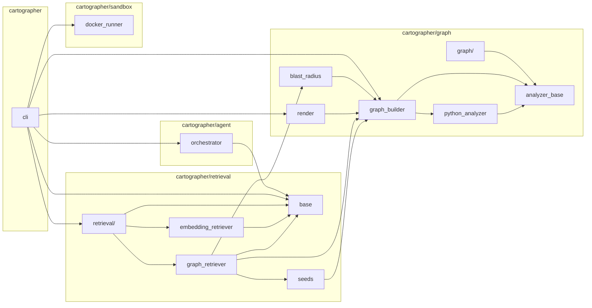

# Cartographer

**A graph-grounded autonomous code agent.** Given a GitHub issue and a repo, it selects the
minimal relevant context using a *program dependency graph* — not a whole-file dump, not
embedding top-k — then plans a fix, edits, runs the repo's real tests in Docker, iterates, and
opens a PR.

## The thesis

Wiring an LLM into a fix-my-code loop is table stakes. On real repos those loops fail the same
two ways: they stuff whole files into the prompt until context blows up and accuracy craters, or
they do naive embedding retrieval and miss the call sites that actually break.

**The contribution is the retriever.** Cartographer parses the repo into a directed graph of
symbols with import, call and inheritance edges, and — given seeds extracted from the issue —
returns the ranked *blast-radius subgraph*: the functions a correct fix must touch. The agent
reasons over that.

The number this project exists to produce, honestly:

> Grounding the agent's context in a program dependency graph lifts SWE-bench Verified
> resolved-rate by **N points** over an embedding-retrieval baseline, using the same model and
> the same agent loop.

If the graph does not beat the baseline, that is a finding and it gets reported as one.

## Status

**Phase 1 — the graph engine is real.** A repo is parsed into a symbol graph with import, call and
inheritance edges; an issue is seeded lexically and expanded into a ranked blast radius. No model is
called yet: the agent loop still emits a placeholder patch, and `Result.stub` says so.

**Phase 2 — scoring is real too.** `cartographer score` grades a patch against a real SWE-bench
instance through the actual `swebench` harness in Docker — no hand-rolled verdict logic. Verified
against real containers on two instances, both resolved: a gold patch on `scikit-learn-14141` and
on `django-16082` (170+ regression tests confirmed unbroken). Along the way this surfaced and fixed
a real defect in running the harness from Windows: it writes its own eval script with `\r\n` line
endings, which a Linux container reads as part of every path and command — see
[`cartographer/sandbox/_win_launcher.py`](cartographer/sandbox/_win_launcher.py).

| Phase | | |
|---|---|---|
| 0 | Scaffold: interfaces, stub CLI, tests | ✅ |
| 1 | Code graph engine (Python analyzer, resolver, blast radius) | core ✅ |
| 2 | Docker sandbox + SWE-bench harness wiring | ✅ |
| 3 | LangGraph agent loop | |
| 4 | Embedding baseline + the ≥50-task comparison | retrieval half ✅, resolved-rate half needs Phase 3 |
| 5 | README polish, CI, architecture diagram | CI ✅, diagram ✅, demo GIF outstanding |
| 6 | Stretch: MCP server | |

### Where the graph stands today

Validated against **59 SWE-bench Verified instances** (requests, pytest, pylint, xarray) by checking
each repo out at its `base_commit`, seeding from the issue text alone, and asking whether the gold
patch's files land in the top *k*. The control is lexical seed extraction with no graph traversal —
because an issue that names a file has already told you the answer, and a retriever has to beat that
to have earned anything.

| k | graph | seeds only |
|---|---|---|
| 1 | 0.356 | 0.356 |
| 3 | 0.557 | 0.557 |
| 5 | 0.616 | 0.599 |
| 10 | **0.684** | 0.633 |
| 20 | **0.774** | 0.633 |

**The graph contributes nothing at k≤3 and +5 to +14 points from k=5 out.** That's mostly
structural, not a quality gap: evidence-first ordering pins every file the issue names ahead of
anything inferred, and across these 59 instances the graph's first genuinely-inferred file lands
at a median rank of 6 (only 19% have one in the top 3 at all) — so k≤3 is measuring how much
evidence the issue itself provides, not how good the graph's inference is. Still a weaker claim
than a thesis about tight context wants, and still reported rather than rounded off.

Reproduce with `uv run python eval/graph_hit_rate.py <swebench.json> <repo-dir> --repos requests`;
raw rows in [`results/phase1_hitrate.json`](results/phase1_hitrate.json).

### Graph vs. the embedding baseline

Same 59 instances, same k values, the real `EmbeddingRetriever` (sentence-transformers/
all-MiniLM-L6-v2, fixed 40-line chunks, cosine top-k — deliberately no function/class awareness,
so the control can't borrow the graph's own idea).

| k | graph | embedding | delta |
|---|---|---|---|
| 1 | 0.356 | 0.144 | +0.212 |
| 3 | 0.556 | 0.441 | +0.116 |
| 5 | 0.616 | 0.572 | +0.044 |
| 10 | 0.684 | **0.708** | -0.024 |
| 20 | **0.774** | 0.750 | +0.024 |

**Not a clean win.** The graph leads clearly at k=1/k=3 — worth 7.5 and ~4 instances, well above
the ~1.7-point noise floor at n=59 — which is exactly where the thesis says it should matter
*least*, since the issue text alone should already answer it there. The lead shrinks through k=5,
and at k=10 the embedding baseline edges ahead, before the graph retakes a k=20 lead that is
itself noise-sized. This is retrieval only, not a resolved-rate — that comparison needs Phase 3's
agent loop to produce real patches for the sandbox to score.

Reproduce with `uv run python eval/embedding_hit_rate.py <swebench.json> <repo-dir> --repos
requests,pytest,pylint,xarray`; raw rows in
[`results/phase4_hitrate.json`](results/phase4_hitrate.json).

### Worked example: a file the issue never mentions

`pytest-dev__pytest-7236`. The issue names **no file at all**, so lexical retrieval has nothing to
go on and scores 0.00 at every k. The graph reaches the gold file at rank 9 of 217:

```
## Seeds extracted (6)
   1.50  src/_pytest/outcomes.py::skip              mentions unittest.skip
   1.50  src/_pytest/debugging.py::post_mortem      mentions post_mortem
   ...

## Ranked files (top 10 of 217)
   1.      src/_pytest/debugging.py     seed
   2.      src/_pytest/outcomes.py      seed
   ...
   8.      src/_pytest/skipping.py      calls from src/_pytest/outcomes.py:skip @1
   9. GOLD src/_pytest/unittest.py      calls from src/_pytest/outcomes.py:skip @1

recall@10 = 1.00
context: 10 snippets, ~604 tokens
```

The issue says `unittest.skip`; `skip` resolves to `outcomes.py::skip`; the file that a correct fix
touches is one call edge away from it. **604 tokens of context out of a 217-file repo** — which is
the discipline the whole project is about.

Regenerate with
`uv run python eval/worked_example.py <swebench.json> <repo-dir> pytest-dev__pytest-7236`.

### Does the guessed half of the call graph pay for itself? Not settled — and that is the result

Half of Python call edges are earned by a repo-wide name match rather than by resolution, so
`min_confidence` drops them without rebuilding and the question gets a number. It got two, and they
disagree.

**Four small repos** (requests, pytest, pylint, xarray; n=59) — dropping every guessed edge *helps*:

| config | @5 | @10 | @20 |
|---|---|---|---|
| all edges | 0.616 | 0.684 | **0.774** |
| drop all guesses (≥0.60) | 0.616 | **0.709** | 0.766 |

**Two large repos** (django, sympy; n=60) — it does not:

| config | @5 | @10 | @20 |
|---|---|---|---|
| all edges | **0.674** | **0.733** | **0.776** |
| drop `ambiguous` (0.25) | 0.658 | 0.733 | 0.776 |
| drop all guesses (≥0.60) | 0.658 | 0.733 | 0.768 |
| import-resolved only (≥0.86) | 0.674 | 0.716 | 0.749 |
| 1 hop | 0.658 | 0.716 | 0.743 |
| 2 hops | 0.674 | 0.733 | 0.776 |
| 4 hops | 0.674 | 0.733 | 0.776 |

**The 2.5-point gain at k=10 did not replicate.** At n≈60 one instance is worth ~1.7 points, so the
original finding was about 1.5 instances of noise, and the default was deliberately left alone
pending exactly this check. Keeping the guessed edges is now an evidenced decision rather than an
unexamined one.

What *does* hold on both sets: **one hop is not enough and three is not better than two**, and
`imports-only` — which also discards `self.method()` resolution through the MRO — is worse than
baseline on the large repos at every k above 5.

Per-repo, graph vs. the no-graph control at k=20 — including the one it does badly on:

| repo | n | graph | seeds only |
|---|---|---|---|
| pydata/xarray | 22 | 1.000 | 0.886 |
| psf/requests | 8 | 0.875 | 0.625 |
| sympy/sympy | 30 | 0.833 | 0.796 |
| pytest-dev/pytest | 19 | 0.737 | 0.553 |
| django/django | 30 | 0.719 | 0.603 |
| **pylint-dev/pylint** | 10 | **0.267** | 0.233 |

⚠️ **pylint is a near-total failure, and the cause is upstream of the graph.** Its issues quote CLI
flags and message codes (`--ignore-paths`, `W0611`) instead of naming code, so seed extraction
starves: **median 2 seeds per issue, against xarray's 9.** The split is total — all seven pylint
instances with ≤3 seeds scored 0.00 at every k, and all three with ≥8 seeds scored 0.67 to 1.00.
A graph cannot rank what it was never pointed at, so the next gain there is in seeding, not in
traversal.

Raw rows in [`results/`](results/), rendered by `uv run python eval/report.py`.

### ...and what is actually wired, drawn by Cartographer itself

`uv run cartographer graph --repo . --exclude tests,eval` — the import graph of this repo,
rendered from the same `CodeGraph` the retriever ranks over. The diagram above is the plan;
this one cannot drift from the code, because it is read out of it.



`cartographer graph --format summary` ranks modules by fan-in, which is a quick check that the
architecture is what you think it is: `retrieval/base.py` has fan-in 10 and **fan-out 0** — the
interface every retriever answers through depends on nothing, which is the invariant the whole
comparison rests on.

Two design lines worth stating up front, because both cost something to hold:

- **A retriever's only channel to the agent is `Context`.** Same dataclass, same fields, both
  modes. If the loop could branch on which retriever it was handed, the comparison would be
  measuring the branch instead of the graph.
- **Analyzers are file-local and syntactic; the graph builder owns every cross-file
  resolution.** A new language costs one `LanguageAnalyzer`, not a new builder.

## License

MIT
